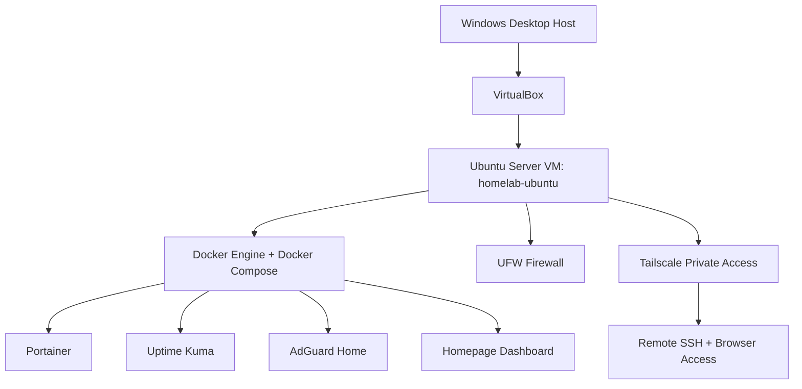
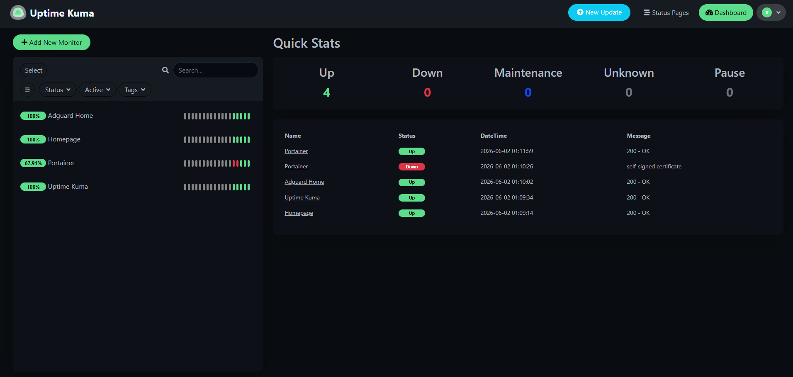
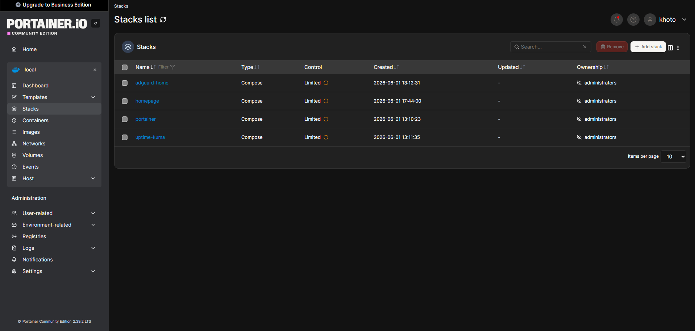
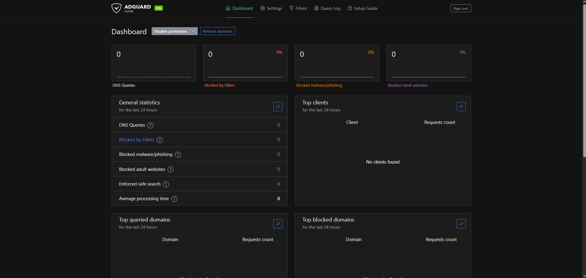
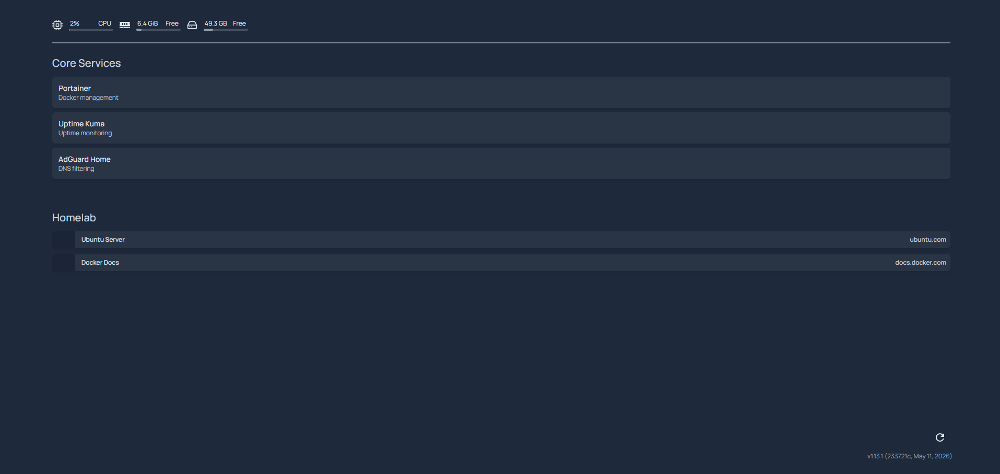
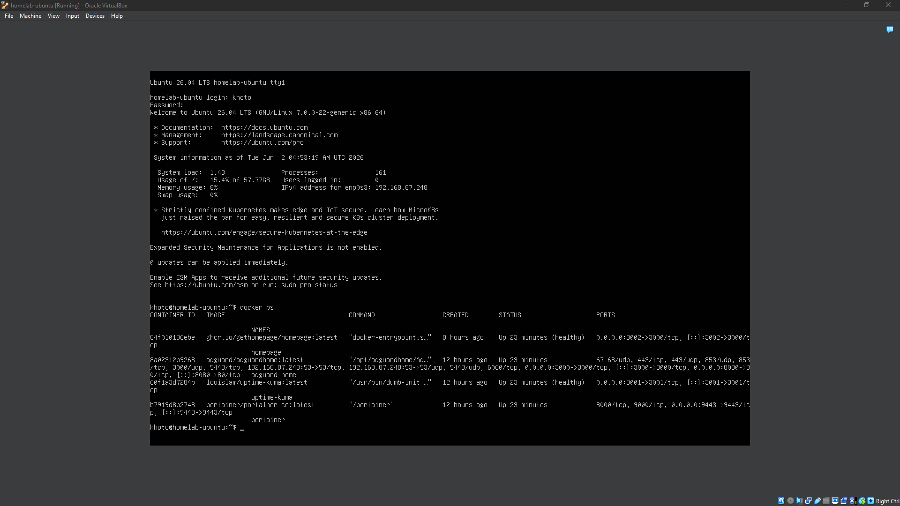
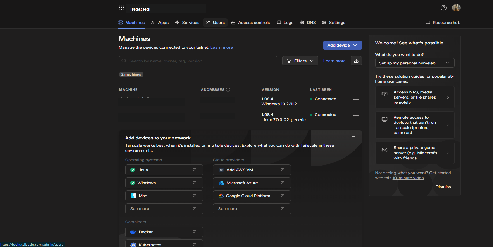
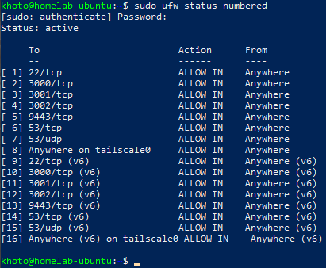
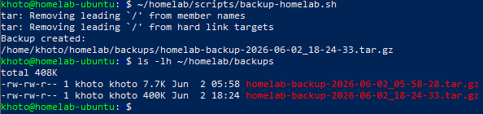

# Desktop PC Homelab Foundation

A local-first homelab built on a Windows desktop using VirtualBox, Ubuntu Server, Docker Compose, Tailscale, UFW, and self-hosted infrastructure services.

The goal of this project was to build a practical foundation for learning systems administration, networking, Docker, monitoring, DNS filtering, remote access, and backup basics. I focused on getting a small but complete environment working first, then documented it clearly enough to reuse, troubleshoot, and discuss in interviews.

## Project Status

- Phase 1: Complete
- Phase 2: Complete except optional later hardening
- Phase 3: GitHub/resume polish complete

## Architecture



## Hardware

- CPU: AMD Ryzen 7 3700X
- RAM: 32 GB
- GPU: Intel Arc A770 16 GB
- Storage:
  - SSD for VM and active services
  - HDD planned for backups, ISOs, screenshots, and documentation
- Host OS: Windows

## VM

- Platform: VirtualBox
- VM name: `homelab-ubuntu`
- OS: Ubuntu Server
- Network: Bridged Adapter
- SSH: enabled and tested from Windows
- Docker: installed and tested
- Docker Compose: installed and tested
- Remote access: Tailscale

The VM is reachable on the local network through a private LAN address and remotely through a private Tailscale address. Public port forwarding is not used.

## Services

| Service | Purpose | Port |
| --- | --- | --- |
| Portainer | Docker and stack management | `9443` |
| Uptime Kuma | Uptime monitoring | `3001` |
| AdGuard Home | DNS filtering | `3000`, `53` |
| Homepage | Central dashboard | `3002` |

All services are kept private/local. Remote access is handled through Tailscale instead of public port forwarding.

### Why These Services Exist

- Portainer gives a visual way to inspect containers, images, volumes, networks, and Compose stacks.
- Uptime Kuma provides a dashboard that confirms the core services are reachable and healthy.
- AdGuard Home provides a safe place to learn DNS filtering before changing router-wide DNS.
- Homepage acts as a lightweight landing page for homelab links and system status.
- Tailscale provides private remote access without exposing the VM directly to the internet.
- UFW provides a simple baseline firewall around SSH, DNS, and service dashboards.

## Phase 1 Summary

Phase 1 focused on building the working homelab foundation.

Completed:

- Installed Ubuntu Server manually in VirtualBox.
- Enabled OpenSSH and confirmed SSH access from Windows.
- Installed Docker Engine and Docker Compose.
- Verified Docker with `docker run hello-world`.
- Created the `~/homelab` folder structure.
- Deployed Portainer, Uptime Kuma, AdGuard Home, and Homepage with Docker Compose.
- Completed first-run setup for the core services.
- Configured Uptime Kuma to monitor all four services.
- Captured proof screenshots and documented the build.

## Phase 2 Summary

Phase 2 focused on secure private access, firewall basics, monitoring proof, and backups.

Completed:

- Installed Tailscale on the Ubuntu VM and Windows host.
- Confirmed SSH and browser access over Tailscale.
- Enabled UFW and allowed only the needed service ports.
- Allowed inbound traffic on the Tailscale interface.
- Fixed Homepage host validation for both LAN and Tailscale access.
- Created and tested a backup script.
- Verified backup archive contents.
- Saved Phase 2 proof screenshots for Tailscale, UFW, and backups.

## Screenshots

| Proof | Screenshot |
| --- | --- |
| Uptime Kuma monitoring all services |  |
| Portainer Compose stacks |  |
| AdGuard Home dashboard |  |
| Homepage dashboard |  |
| Docker containers running |  |
| Tailscale machines |  |
| UFW firewall rules |  |
| Backup script output |  |

## Repository Layout

```text
.
|-- README.md
|-- docs/
|   |-- architecture.md
|   |-- backups.md
|   |-- lessons-learned.md
|   |-- network-notes.md
|   |-- phase-1-checklist.md
|   |-- phase-2-checklist.md
|   |-- security-networking.md
|   |-- services.md
|   |-- setup-log.md
|   `-- screenshots/
|-- scripts/
|   |-- backup-homelab.sh
|   |-- create-homelab-folders.sh
|   `-- install-docker.sh
`-- stacks/
    |-- adguard-home/
    |-- homepage/
    |-- portainer/
    `-- uptime-kuma/
```

## What I Learned

- Built and configured an Ubuntu Server VM in VirtualBox.
- Used bridged networking to make the VM reachable as a normal LAN device.
- Installed Docker Engine and Docker Compose without using the Ubuntu Docker snap.
- Organized services as separate Compose stacks.
- Used Portainer to inspect and manage Docker stacks.
- Used Uptime Kuma to monitor service health and troubleshoot TLS behavior.
- Configured AdGuard Home while avoiding router-wide DNS changes too early.
- Used Tailscale for private remote access without exposing public ports.
- Enabled UFW and allowed only the service ports needed for the lab.
- Wrote and tested a backup script for homelab configs and documentation.
- Documented proof screenshots, ports, troubleshooting notes, and lessons learned.

## Troubleshooting Highlights

- VirtualBox NAT gave internet access, but Bridged Adapter made SSH and dashboards easier to reach from Windows.
- Portainer uses a self-signed HTTPS certificate; Uptime Kuma may need TLS verification ignored for that monitor.
- Homepage required `HOMEPAGE_ALLOWED_HOSTS` to include both LAN and Tailscale hostnames/IPs.
- AdGuard Home DNS should be tested on one device before changing router-wide DNS.
- UFW should be enabled only after confirming SSH and service ports are allowed.

More detail is available in [docs/lessons-learned.md](docs/lessons-learned.md) and [docs/security-networking.md](docs/security-networking.md).

## Backup

The backup script is stored at:

```text
scripts/backup-homelab.sh
```

It backs up:

- Docker Compose stacks
- Documentation
- `README.md`

## Security Notes

- Services are not exposed directly to the public internet.
- Remote access uses Tailscale.
- Passwords, SSH keys, tokens, and secrets are not stored in this repository.
- Router DNS has not been pointed to AdGuard Home yet.

## Future Improvements

- Enable SSH key-only login after confirming key access.
- Add Uptime Kuma notifications.
- Test AdGuard DNS from one device before router-wide rollout.
- Copy backups from VM storage to the HDD.
- Add a restore test for the backup archive.
- Add more services only after the foundation stays stable.

## Next Planned Phases

- Phase 4: Security monitoring with Wazuh. See [docs/phase-4-wazuh-security-monitoring.md](docs/phase-4-wazuh-security-monitoring.md).
- Phase 4 starter workflow: Linux, SSH, and Docker log review. See [docs/security-monitoring.md](docs/security-monitoring.md) and [docs/phase-4-checklist.md](docs/phase-4-checklist.md).
- Phase 5: Windows Server and Active Directory lab. See [docs/phase-5-windows-server-active-directory.md](docs/phase-5-windows-server-active-directory.md).

## Resume Bullet Examples

- Built a private desktop homelab using VirtualBox, Ubuntu Server, Docker Compose, Tailscale, UFW, and self-hosted infrastructure services.
- Deployed Portainer, Uptime Kuma, AdGuard Home, and Homepage Dashboard with local and Tailscale-based access.
- Implemented baseline firewall rules, uptime monitoring, backup scripting, and troubleshooting documentation for a containerized homelab environment.
- Documented architecture, service ports, security notes, lessons learned, and proof screenshots for GitHub portfolio presentation.

Detailed resume bullets are available in [docs/resume-bullets.md](docs/resume-bullets.md).

## GitHub Publish Notes

This folder is GitHub-ready. Publishing steps are documented in [docs/github-publish.md](docs/github-publish.md).
